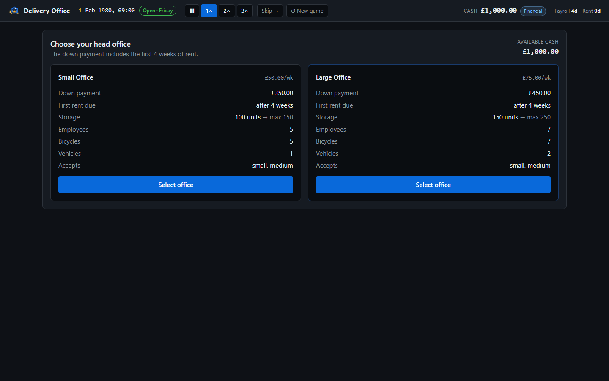
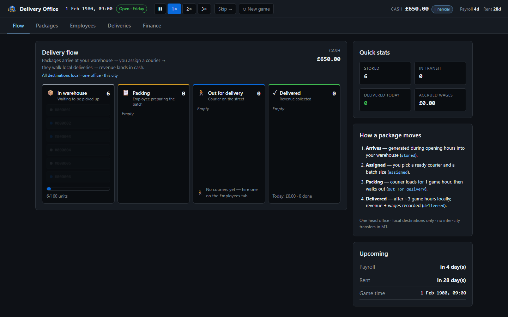
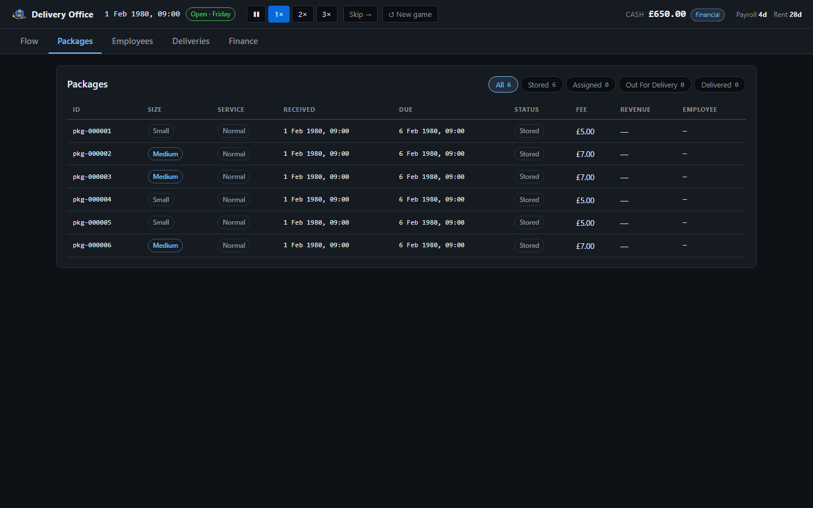
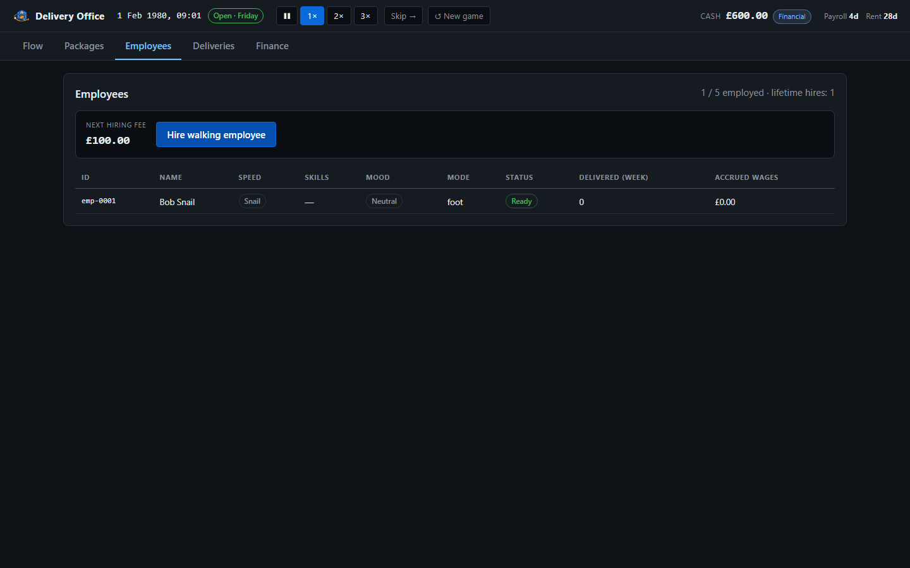
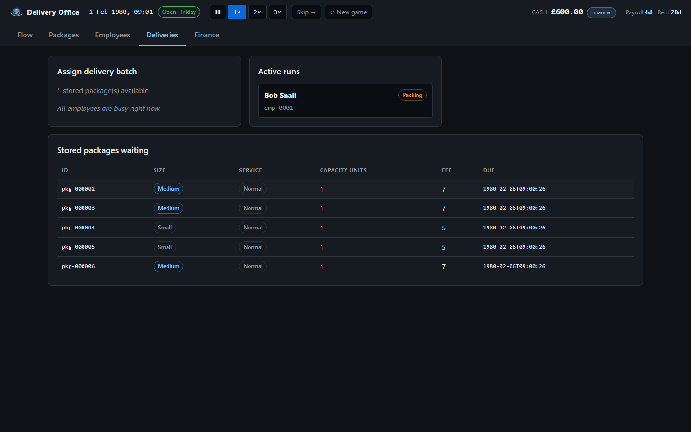
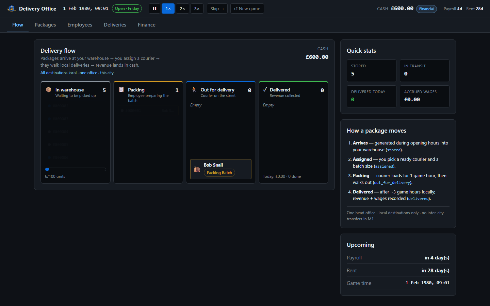
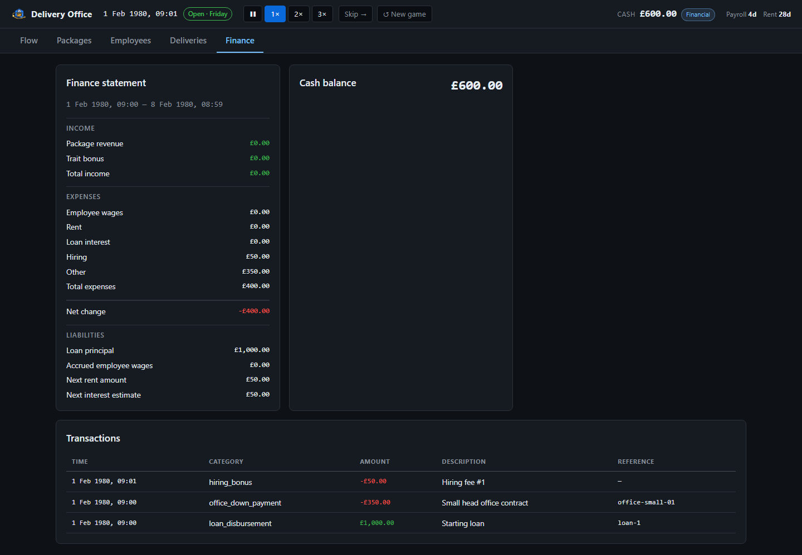

# Delivery Office

A local-first, single-player logistics management game and a collaboration/GitHub learning project.

The project starts deliberately small: build a complete vertical slice in which packages arrive at a warehouse, one walking employee can be hired and assigned a batch, deliveries complete, and money is accounted for.

## Collaboration

- Daniel: backend/game logic.
- Alexander: frontend/UI.
- Backend: Go.
- Frontend: React + TypeScript.
- Data exchange: versioned REST API using JSON.
- Persistence: SQLite.
- Git/GitHub: develop and commit locally; push to the organisation repository when ready.
- GitHub Issues + Projects should become the working task/roadmap system.

The API contract is the boundary between backend and frontend. The backend owns authoritative game state and game rules. The frontend requests actions and renders returned state; it must not calculate authoritative business/game logic.

## Documentation

- `SPEC.md` — canonical game, backend and API contract specification.
- `ROADMAP.md` — deliberately small implementation roadmap.

When implementation and documentation disagree, treat the discrepancy as something to resolve explicitly rather than silently changing the contract.

## Screenshots

Office select:



Delivery flow pipeline:



Packages, employees, deliveries, finance:







## Frontend (React)

```bash
cd frontend
npm install
npm run dev:mock    # http://localhost:5173 with in-Vite mock API
```

Tests:

```bash
npm run test        # Vitest unit + component + API contract
npm run test:e2e    # Playwright E2E + axe accessibility
npm run test:all    # lint + vitest + build + e2e
```


## Architecture principles

1. **Backend is the source of truth.**
2. **Frontend is treated as untrusted input.**
3. **API contracts are stable.** Prefer additive fields/features. Removing, renaming, or changing the meaning/type of existing fields requires deliberate versioning.
4. Start APIs under `/api/v1`.
5. Keep game domains modular rather than building one giant file/package.
6. Keep persistence behind an interface so SQLite can be replaced later without redesigning the API.
7. Local-first: bind the backend to localhost during initial development.
8. Validate all incoming API data.
9. The game clock is independent of the computer's wall clock. Closing the game does not advance the simulation.
10. Avoid scope creep until the first playable vertical slice works.

## Initial backend domains

Suggested conceptual modules/packages:

- clock
- game
- player
- office
- packages
- employees
- delivery
- finance
- storage/persistence
- api

These are domain boundaries, not a requirement that every module immediately needs complex interfaces.

## First playable target

The first end-to-end implementation intentionally excludes most advanced mechanics:

**Choose office → packages arrive → hire one walking employee → assign a package batch → delivery completes → revenue/wages are recorded → state can be saved/loaded → frontend can read/control it through JSON API.**

Weather, random events, drones, aircraft, employee training, retirement, decorations and sophisticated automation are not required for this slice.
